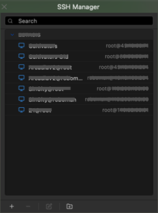
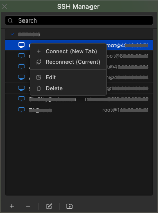
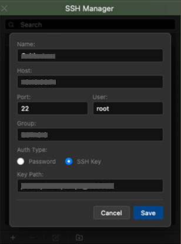

# iTerm2 Toolbox: SSH & Snippets Manager

🚀 A powerful set of Python-based, native-feeling GUI tools for iTerm2 on macOS, providing an elegant way to manage SSH connections and execute reusable shell snippets right from a side panel.



---

## 📌 Features

### 🖥️ 1. SSH Manager
A fully integrated GUI for managing SSH servers, keys, and passwords.
- **Save & Organize:** Keep all your SSH hostnames, ports, and credentials in one place.
- **Collapsible Groups:** Organize servers logically with drag-and-drop support.
- **One-Click Connect:** Open standard SSH or `expect`-wrapped password connections instantly.




### 📜 2. Snippets Manager
A parallel tool for organizing and rapidly firing off shell commands without leaving your terminal.
- **Command Library:** Save complex or frequently used bash/shell commands.
- **Run Instantly:** Double-click or right-click to run your snippet automatically in the current tab.
- **Paste & Edit:** Right-click to carefully paste a snippet for editing *before* executing.
- **Group Management:** Easily categorize your snippets (e.g., "Docker", "Git", "Maintenance").

---

## 🛠️ Installation & Setup

These scripts leverage iTerm2's built-in Python API. 

1. **Enable Python API in iTerm2:**
   - Open iTerm2 > `Settings` > `General` > `Magic`
   - Check **Enable Python API**.

2. **Place the Scripts:**
   - Open your terminal and paste:
     ```bash
     mkdir -p "$HOME/Library/Application Support/iTerm2/Scripts"
     cd "$HOME/Library/Application Support/iTerm2/Scripts"
     ```
   - Clone or copy the `SSHRunner` and `SnippetRunner` folders into this directory.

3. **Install Dependencies (if needed):**
   *(These scripts use `aiohttp` for their local webview backend.)*
   - In iTerm2, go to `Scripts` > `Manage` > `Install Python Runtime` (if you haven't already).
   - If prompted for dependencies, ensure `aiohttp` is available in your iTerm2 environment.

4. **AutoLaunch (Optional but Recommended):**
   - Move or symlink these scripts inside the `AutoLaunch` folder:
     ```bash
     mkdir -p "$HOME/Library/Application Support/iTerm2/Scripts/AutoLaunch"
     cp SSHRunner/SSHRunner.py AutoLaunch/
     cp SnippetRunner/SnippetRunner.py AutoLaunch/
     ```
   - This prevents you from having to manually start them every time iTerm2 opens.

---

## 🚀 Usage

- Go to the top menu bar in iTerm2 (`Scripts`).
- Select **SSHRunner.py** or **SnippetRunner.py**.
- A side panel will appear on the right side of your terminal window.
- **Add (+):** Create a new item (Server or Snippet).
- **Edit/Delete:** Use the context menu (Right-Click) or the bottom toolbar.
- **Search:** Quickly filter through large lists using the search bar at the top of the panel.

## 🔒 Security Note
Passwords and Snippets are saved locally in plaintext JSON files (`servers.json` and `snippets.json`) inside the respective script directories within your iTerm2 App Support folder. Ensure your macOS account is secure. Do not commit these `.json` files if you fork this repository!

---

💡 *Crafted specifically to make the terminal experience cleaner, faster, and more organized.*
